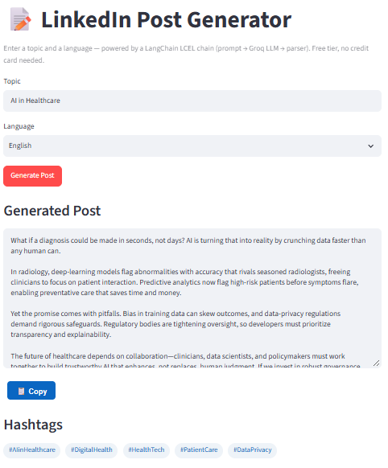
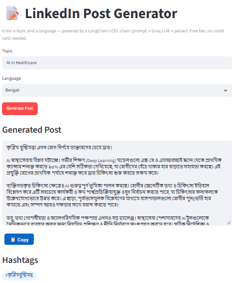
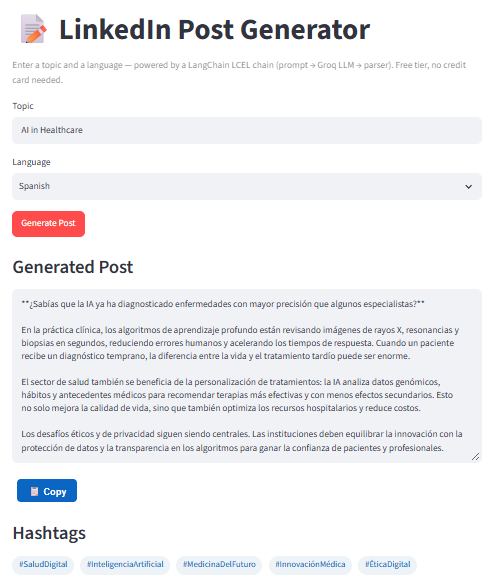
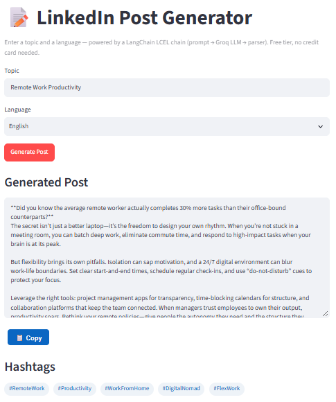
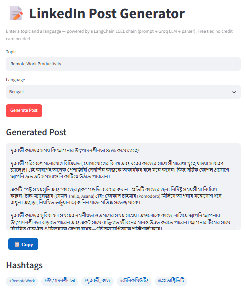
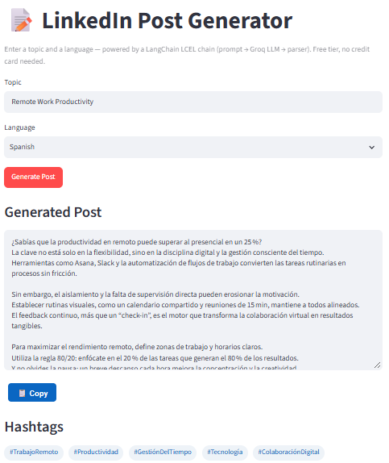
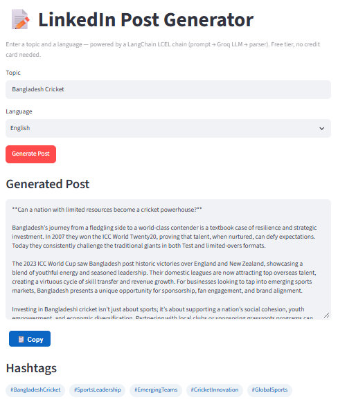

# 📝 LinkedIn Post Generator

<p align="center">
  
  
  
  
  
</p>

<p align="center">
  
  
  
</p>

<p align="center">
  <b>Generate professional LinkedIn posts from a topic and language using LangChain, Groq, and Streamlit.</b>
</p>

---

## 📌 Table of Contents

* [Overview](#-overview)
* [Task Objective](#-task-objective)
* [Features](#-features)
* [Architecture](#-architecture)
* [Why a Chain Instead of an Agent?](#-why-a-chain-instead-of-an-agent)
* [Model Configuration](#-model-configuration)
* [Prompt Design](#-prompt-design)
* [Screenshots](#-screenshots)
* [Project Structure](#-project-structure)
* [Prerequisites](#-prerequisites)
* [Installation](#-installation)
* [Environment Configuration](#-environment-configuration)
* [Running the Application](#-running-the-application)
* [Previewing Prompts](#-previewing-prompts)
* [Testing](#-testing)
* [Code Quality and CI](#-code-quality-and-ci)
* [Error Handling](#-error-handling)
* [Security](#-security)
* [Limitations](#-limitations)
* [Troubleshooting](#-troubleshooting)
* [Demo Walkthrough](#-demo-walkthrough)
* [Submission Checklist](#-submission-checklist)
* [Future Improvements](#-future-improvements)
* [License](#-license)

---

## 🎯 Overview

**LinkedIn Post Generator** is a LangChain-based application that generates professional LinkedIn posts from two user-provided inputs:

1. **Topic** — the subject of the LinkedIn post.
2. **Language** — the language in which the post should be generated.

The application uses a structured LangChain LCEL pipeline:

```text
User Input
    ↓
Prompt Template
    ↓
Groq LLM
    ↓
String Output Parser
    ↓
Post + Hashtags
    ↓
Streamlit UI
```

The generated content is displayed through a simple Streamlit interface with:

* A topic input field
* Language selection
* Support for manually entering another language
* Loading feedback
* Generated post display
* One-click copy functionality
* Hashtag display
* Hashtag copy functionality
* `.txt` download functionality
* Friendly validation and error messages

---

## 🎯 Task Objective

The objective of this Module 21 project is to build an AI-powered application that generates LinkedIn posts based on:

* A user-selected **topic**
* A user-selected **language**

The application should produce professional LinkedIn-style content and relevant hashtags while demonstrating the use of LangChain for LLM application development.

---

## ✨ Features

### 🤖 AI-Powered Post Generation

Generates professional LinkedIn-style posts from a simple topic and language input.

### 🌍 Multi-Language Support

The application supports predefined languages including:

* English
* Bengali
* Spanish
* French
* Arabic
* Hindi

It also provides an **Other (type manually)** option for additional languages.

### 🔗 LangChain LCEL Pipeline

The application uses LangChain's modern LCEL syntax:

```python
prompt | llm | StrOutputParser()
```

This keeps the generation pipeline explicit, modular, and easy to maintain.

### #️⃣ Automatic Hashtag Generation

The LLM is instructed to generate relevant hashtags separately from the main post. The application parses those hashtags and displays them independently.

### 📋 One-Click Copy

Users can copy:

* The complete LinkedIn post
* All generated hashtags

directly to the clipboard.

### ⬇️ Download Generated Content

The application provides a download button that saves the generated post and hashtags as:

```text
linkedin_post.txt
```

### ⏳ Loading Feedback

A Streamlit spinner provides visual feedback while the LLM request is being processed.

### 🛡️ Input Validation

Empty topics and empty language values are handled before making an LLM request.

### 🚦 Rate-Limit Handling

The application specifically handles Groq rate-limit errors, retries a transient failure once, and displays a user-friendly message if the request cannot be completed.

### 🧪 Automated Testing

The project includes unit tests that use fake LLM implementations rather than making real API calls during testing.

### 🔍 Ruff Linting

The project uses Ruff to maintain consistent Python code quality.

### 🔄 Continuous Integration

GitHub Actions runs linting and automated tests on pushes and pull requests.

---

## 🏗️ Architecture

The project follows a simple separation-of-concerns architecture.

```text
                    ┌─────────────────────┐
                    │    Streamlit UI     │
                    │       app.py        │
                    └──────────┬──────────┘
                               │
                               ▼
                    ┌─────────────────────┐
                    │ generate_linkedin   │
                    │       _post()       │
                    └──────────┬──────────┘
                               │
                               ▼
                    ┌─────────────────────┐
                    │   LangChain LCEL    │
                    │                     │
                    │ Prompt → LLM →      │
                    │ StrOutputParser     │
                    └──────────┬──────────┘
                               │
                               ▼
                    ┌─────────────────────┐
                    │      Groq API       │
                    │ GPT-OSS-20B         │
                    └──────────┬──────────┘
                               │
                               ▼
                    ┌─────────────────────┐
                    │ Post + Hashtags     │
                    └─────────────────────┘
```

### Main Components

| Component                  | Responsibility                                     |
| -------------------------- | -------------------------------------------------- |
| `app.py`                   | Streamlit user interface                           |
| `chain.py`                 | LangChain chain and generation logic               |
| `prompts.py`               | Prompt template and output formatting instructions |
| `tests/test_chain.py`      | Automated tests                                    |
| `requirements.txt`         | Runtime dependencies                               |
| `requirements-dev.txt`     | Development/testing dependencies                   |
| `pyproject.toml`           | Ruff and project configuration                     |
| `Makefile`                 | Convenient development commands                    |
| `.env.example`             | Environment variable template                      |
| `.github/workflows/ci.yml` | GitHub Actions CI workflow                         |

---

## 🔗 Why a Chain Instead of an Agent?

Although the assignment refers to the project as an "AI Agent," the actual functionality requires a fixed LLM pipeline rather than dynamic tool selection.

An **agent** generally decides at runtime which tool or action to use and in what order.

A **chain** follows a predefined sequence of operations.

This project has one straightforward workflow:

```text
Prompt → LLM → Output Parser
```

There are no external tools, databases, APIs, or multiple actions that the model needs to select between.

Therefore, a LangChain **LCEL chain** is appropriate for this application.

Using a full agent architecture would introduce additional complexity without providing a corresponding benefit for this particular task.

---

## 🤖 Model Configuration

The application currently uses:

```python
model = "openai/gpt-oss-20b"
```

through LangChain's Groq integration.

The LLM configuration in `chain.py` is:

```python
_llm = ChatGroq(
    model="openai/gpt-oss-20b",
    temperature=0.7,
    max_tokens=800,
)
```

### Configuration Parameters

| Parameter     |                Value | Purpose                                                |
| ------------- | -------------------: | ------------------------------------------------------ |
| `model`       | `openai/gpt-oss-20b` | LLM used for generation                                |
| `temperature` |                `0.7` | Allows natural variation in generated posts            |
| `max_tokens`  |                `800` | Provides enough output space for the post and hashtags |

The `max_tokens` value was increased from `500` to `800` to provide more room for complete LinkedIn posts and hashtag output.

> **Note:** Groq model availability, pricing, and rate limits can change. Check the current Groq documentation and account limits before deploying the application at scale.

---

## 🧠 Prompt Design

The prompt is maintained separately in `prompts.py`.

This separation makes it possible to improve the writing instructions without modifying the core chain implementation.

The prompt is responsible for communicating requirements such as:

* The requested topic
* The requested language
* Professional LinkedIn-style writing
* Appropriate structure and readability
* Relevant hashtags
* A predictable delimiter between the post and hashtag sections

The application then parses the LLM response into:

```text
post
hashtags
```

This is more reliable than depending on a particular piece of generated prose.

---

## 📸 Screenshots

The screenshots below demonstrate the application's actual generated output across multiple topics and languages.

### 🏥 AI in Healthcare

#### English



#### Bengali



#### Spanish



---

### 💼 Remote Work Productivity

#### English



#### Bengali



#### Spanish



---

### 🏏 Bangladesh Cricket

#### English



---

### 📊 Screenshot Coverage

| Topic                    | English | Bengali | Spanish |
| ------------------------ | :-----: | :-----: | :-----: |
| AI in Healthcare         |    ✅    |    ✅    |    ✅    |
| Remote Work Productivity |    ✅    |    ✅    |    ✅    |
| Bangladesh Cricket       |    ✅    |    —    |    —    |

These screenshots provide concrete evidence of:

* Topic-based generation
* Multi-language generation
* Different content domains
* Generated hashtags
* Streamlit UI output
* The application's actual behavior

---

## 📁 Project Structure

```text
linkedin-post-generator/
│
├── .github/
│   └── workflows/
│       └── ci.yml                    # GitHub Actions: lint + tests
│
├── screenshots/
│   ├── ai_in_healthcare_bengali.png
│   ├── ai_in_healthcare_english.png
│   ├── ai_in_healthcare_spanish.png
│   ├── remote_work_productivity_bengali.png
│   ├── remote_work_productivity_english.png
│   ├── remote_work_productivity_spanish.png
│   └── bangladesh_cricket_english.png
│
├── tests/
│   └── test_chain.py                 # Unit tests
│
├── .env.example                      # Environment variable template
├── .gitignore                        # Git ignore rules
├── Makefile                          # Development shortcuts
├── README.md                         # Project documentation
├── app.py                            # Streamlit application
├── chain.py                          # LangChain generation pipeline
├── prompts.py                        # Prompt template
├── requirements.txt                  # Runtime dependencies
├── requirements-dev.txt              # Development dependencies
└── pyproject.toml                    # Ruff/project configuration
```

> If your repository contains additional files such as `main.py`, include them in this tree according to their actual role.

---

## 💻 Prerequisites

Before running the project, make sure you have:

* Python **3.11 or newer**
* `pip`
* Git
* A Groq API key
* Internet access for API requests

A virtual environment is strongly recommended.

---

## ⚙️ Installation

### 1. Clone the repository

```bash
git clone <your-repository-url>
cd linkedin-post-generator
```

### 2. Create a virtual environment

#### Linux / macOS / WSL

```bash
python3 -m venv .venv
source .venv/bin/activate
```

#### Windows

```powershell
py -3.11 -m venv .venv
.venv\Scripts\activate
```

### 3. Install dependencies

```bash
pip install -r requirements.txt
```

For development and testing:

```bash
pip install -r requirements-dev.txt
```

---

## 🔐 Environment Configuration

Create a `.env` file from the provided example:

### Linux / macOS / WSL

```bash
cp .env.example .env
```

### Windows

```powershell
copy .env.example .env
```

Add your Groq API key:

```env
GROQ_API_KEY=your_groq_api_key_here
```

The `.env` file should **never be committed to Git**.

Only `.env.example` should be included in the repository.

---

## ▶️ Running the Application

The Streamlit interface should be started with Streamlit's launcher.

```bash
streamlit run app.py
```

After starting the application, Streamlit will provide a local URL, normally:

```text
http://localhost:8501
```

Open that address in your browser.

### Using the Application

1. Enter a topic.
2. Select a language.
3. If necessary, choose **Other (type manually)** and enter a custom language.
4. Click **Generate Post**.
5. Wait for the LLM response.
6. Review the generated post.
7. Copy the post or hashtags using the copy buttons.
8. Optionally download the generated content as a `.txt` file.

---

## 🧪 Previewing Prompts

The prompt template can be previewed without making an LLM API request.

Run:

```bash
python prompts.py
```

or, if configured in the Makefile:

```bash
make preview-prompts
```

This is useful for inspecting the rendered prompt while avoiding unnecessary API calls and token usage.

---

## 🧪 Testing

Install the development dependencies:

```bash
pip install -r requirements-dev.txt
```

Run the complete test suite:

```bash
pytest tests/ -v
```

The project currently contains **11 automated tests**.

### What the Tests Cover

The tests verify application behavior including:

* Empty topic validation
* Empty language validation
* Input whitespace handling
* Hashtag parsing
* Hashtag removal from the main post
* Missing hashtag delimiter handling
* Successful generation
* Persistent rate-limit handling
* Transient rate-limit handling
* Generic exception handling
* Prevention of unnecessary LLM calls during invalid input

### Testing Philosophy

Real LLM calls are not used in the automated test suite because they:

* Consume API tokens
* Require an API key
* Depend on network availability
* Produce non-deterministic creative output
* Can be affected by external rate limits

Instead, the tests inject fake LLM implementations to test the application's own logic deterministically.

The quality of the actual generated writing is therefore evaluated through manual application testing and the screenshots included in this repository rather than by asserting exact LLM-generated text.

---

## 🔍 Code Quality and CI

### Ruff

The project uses [Ruff](https://docs.astral.sh/ruff/) for Python linting.

Run:

```bash
ruff check .
```

A clean result should look similar to:

```text
All checks passed!
```

### GitHub Actions

The CI workflow in:

```text
.github/workflows/ci.yml
```

runs automated checks on repository changes.

The workflow performs:

1. Repository checkout
2. Python environment setup
3. Dependency installation
4. Ruff linting
5. Pytest execution

The CI pipeline does not require a real Groq API key because the automated tests use fake LLM implementations.

---

## 🛡️ Error Handling

The application is designed to fail gracefully rather than exposing raw Python stack traces to the end user.

### Input Validation

Invalid inputs are detected before an LLM request is made.

For example:

```text
⚠️ Please enter a topic before generating a post.
```

### Rate Limits

When Groq returns a rate-limit error, the application:

1. Detects the specific rate-limit exception.
2. Waits briefly.
3. Retries once.
4. Displays a user-friendly message if the second attempt also fails.

### Other Exceptions

Unexpected errors are converted into a readable error message rather than allowing the Streamlit interface to fail without context.

---

## 🔒 Security

The project follows basic API-key security practices.

### Never Commit `.env`

Your actual API key belongs in:

```text
.env
```

and **not** in Git.

The repository should contain:

```text
.env.example
```

instead.

### Recommended `.gitignore`

Make sure sensitive and generated files are ignored:

```gitignore
.env
.venv/
__pycache__/
.pytest_cache/
.ruff_cache/
```

### If an API Key Is Accidentally Committed

Immediately revoke or rotate the exposed key through the provider's dashboard and replace it with a new key.

---

## ⚠️ Limitations

This project intentionally keeps the architecture simple.

### Single-Purpose Generation

The application generates LinkedIn posts but does not perform:

* Web research
* Fact verification
* Source citation
* Image generation
* LinkedIn API publishing
* Content scheduling
* User authentication
* Persistent conversation history

### LLM-Generated Content

The generated content is produced by an LLM and should be reviewed before being published publicly.

The application does not independently verify factual claims made in generated posts.

### API Dependency

Generation requires a working Groq API connection and a valid API key.

### Rate Limits

Free-tier usage is subject to the provider's current rate and usage limits.

---

## 🐛 Troubleshooting

### `python app.py` does not start the Streamlit interface

Use:

```bash
streamlit run app.py
```

rather than:

```bash
python app.py
```

`app.py` is a Streamlit application and should be launched using Streamlit's command-line interface.

### API Key Error

Verify that:

```text
.env
```

exists in the project root and contains:

```env
GROQ_API_KEY=your_api_key
```

Also make sure the virtual environment is activated and the required dependencies are installed.

### Model Not Found

If the configured model becomes unavailable, check the models currently available to your Groq account and update the `model=` value in `chain.py`.

The current project configuration is:

```python
model = "openai/gpt-oss-20b"
```

### Rate-Limit Error

Wait briefly and try again. Repeated requests in a short period can trigger provider rate limits.

### Streamlit Does Not Open the Browser Automatically

If Streamlit starts successfully but your browser does not open automatically, manually visit:

```text
http://localhost:8501
```

---

## 🎬 Demo Walkthrough

A short **2–3 minute** demonstration can cover the following.

### 1. Introduction — 0:00–0:20

Explain:

> This is a LangChain-based LinkedIn Post Generator that creates professional posts from a topic and language using Groq's GPT-OSS-20B model.

### 2. Project Structure — 0:20–0:45

Show:

* `prompts.py`
* `chain.py`
* `app.py`
* `tests/`
* `screenshots/`

Briefly explain the separation between the prompt, generation logic, UI, and tests.

### 3. Live Application — 0:45–1:45

Run:

```bash
streamlit run app.py
```

Demonstrate:

* `AI in Healthcare` in English
* A Bengali or Spanish generation
* Copying the generated post
* Copying hashtags
* Downloading the generated `.txt` file

### 4. Validation — 1:45–2:05

Try generating a post without entering a topic.

Show that the application displays a friendly validation message instead of making an unnecessary LLM request.

### 5. Testing and Code Quality — 2:05–2:30

Run:

```bash
pytest tests/ -v
```

Then:

```bash
ruff check .
```

Explain that the automated tests do not require a real API key.

### 6. Conclusion — 2:30–3:00

Briefly summarize:

* LangChain LCEL
* Groq GPT-OSS-20B
* Streamlit
* Multi-language generation
* Hashtag parsing
* Error handling
* Automated testing
* Ruff
* GitHub Actions

---

## ✅ Submission Checklist

Before submitting the project, verify the following:

* [ ] Repository is pushed to GitHub.
* [ ] `README.md` is complete.
* [ ] `.env` is **not** committed.
* [ ] `.env.example` is included.
* [ ] `requirements.txt` is included.
* [ ] `requirements-dev.txt` is included.
* [ ] `pyproject.toml` is included.
* [ ] `Makefile` is included.
* [ ] `tests/` is included.
* [ ] GitHub Actions workflow is included.
* [ ] All seven screenshots are included in `screenshots/`.
* [ ] `streamlit run app.py` successfully starts the application.
* [ ] English generation has been tested.
* [ ] Bengali generation has been tested.
* [ ] Spanish generation has been tested.
* [ ] Multiple topics have been tested.
* [ ] Copy functionality has been tested.
* [ ] Hashtag generation has been tested.
* [ ] `.txt` download has been tested.
* [ ] Empty-input validation has been tested.
* [ ] `pytest tests/ -v` passes.
* [ ] `ruff check .` passes.
* [ ] Demo video has been recorded if required by the assignment.

---

## 🚀 Future Improvements

Possible future enhancements include:

* [ ] LinkedIn API integration for direct publishing
* [ ] User authentication
* [ ] Saved post history
* [ ] Post editing before download
* [ ] Custom tone selection
* [ ] Adjustable post length
* [ ] Industry-specific writing styles
* [ ] AI-generated post images
* [ ] Content scheduling
* [ ] Web-based research and source citations
* [ ] Additional LLM provider support
* [ ] Deployment to Streamlit Community Cloud or another hosting platform

---

## 📄 License

This project is released under the **MIT License**.

See the `LICENSE` file for the complete license text.

---

## 👨‍💻 Author

**Shaiful Isalm**

A practical AI application demonstrating modern LLM application development with LangChain, Groq, and Streamlit.

---

<p align="center">
  <b>📝 Generate. ✨ Refine. 🚀 Share.</b>
</p>
